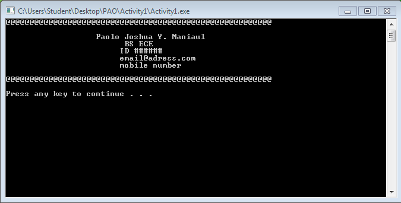
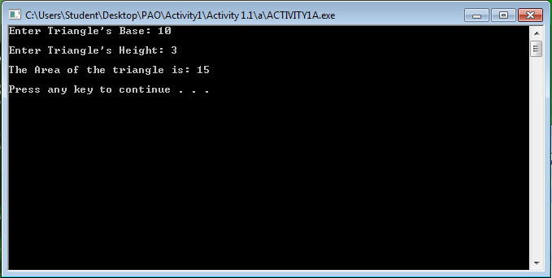
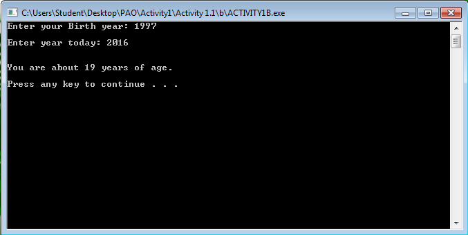
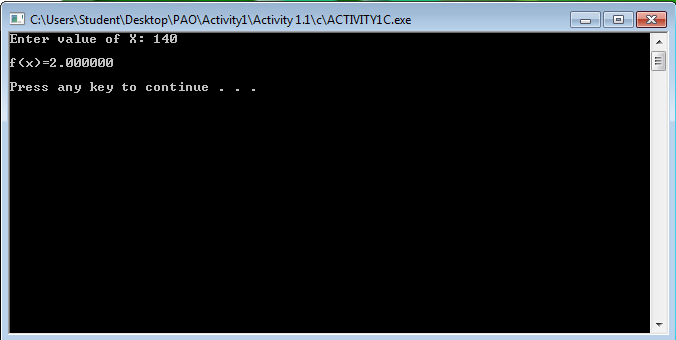

# Activity-1---Paolo-Maniaul

# Activity 1
```
#include <stdio.h>
#include <stdlib.h>

/* run this program using the console pauser or add your own getch, system("pause") or input loop */

int main(int argc, char *argv[]) {
	
	
	printf("@@@@@@@@@@@@@@@@@@@@@@@@@@@@@@@@@@@@@@@@@@@@@@@@@@@@@@@@\n\n");
	printf("\t\t   Paolo Joshua Y. Maniaul\n\t\t\t BS ECE\n\t\t\tID ######\n\t\t\temail@adress.com\n\t\t\tmobile number\n\n");
	printf("@@@@@@@@@@@@@@@@@@@@@@@@@@@@@@@@@@@@@@@@@@@@@@@@@@@@@@@@\n\n");
	
	system("PAUSE");
	return 0;
}
```


# Activity 1A
```
#include <stdio.h>
#include <stdlib.h>

/* run this program using the console pauser or add your own getch, system("pause") or input loop */

int main(int argc, char *argv[]) {
	
	int b,h,area;
	printf("Enter Triangle's Base: ");
	scanf("%d", &b);
	
	printf("\nEnter Triangle's Height: ");
	scanf("%d", &h);
	
	area=(b*h)/2;
	printf("\nThe Area of the triangle is: %d\n\n", area);
	system("PAUSE");
	return 0;
}
```


# Activity 1B
```
#include <stdio.h>
#include <stdlib.h>

/* run this program using the console pauser or add your own getch, system("pause") or input loop */

int main(int argc, char *argv[]) {
	
	int birth,year,age;
	printf("Enter your Birth year: ");
	scanf("%d",&birth);
	printf("\nEnter year today: ");
	scanf("%d",&year);
	age = year-birth;
	printf("\n\nYou are about %d years of age.\n\n",age);
	system("PAUSE");
	return 0;
}
```


# Activity 1C
```
#include <stdio.h>
#include <stdlib.h>

/* run this program using the console pauser or add your own getch, system("pause") or input loop */

int main() {
	
	float x,func;
	printf("Enter value of X: ");
	scanf("%f", &x);
	func=x/70;
	printf("\nf(x)=%f\n\n", func);
	
	system("PAUSE");
	return 0;
	
}
```

